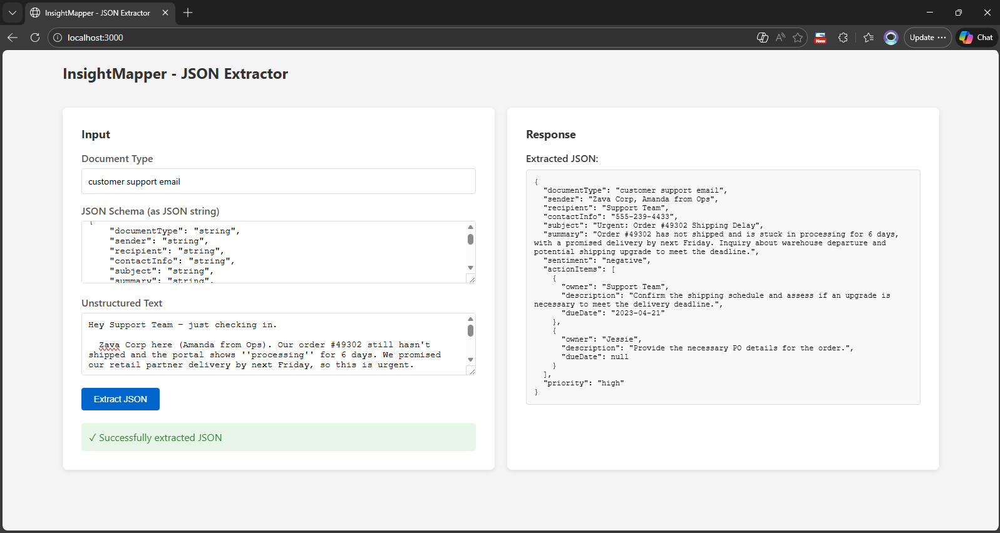

# Foundry Local Quest

A local quest management system built with Node.js and vanilla JavaScript that combines server-side processing with client-side user interactions.

## Project Overview

Foundry Local Quest is designed to facilitate quest creation, mapping, and management in a local environment. The application provides a full-stack solution with:

- **Backend Server**: Express.js-based API for handling quest data and logic
- **Frontend Client**: Interactive HTML/JavaScript interface for user interactions
- **Insight Mapper**: Core module for processing and mapping quest-related insights or data

## Architecture

```
┌─────────────┐          ┌──────────────┐         ┌─────────────────┐
│ client.html │  ◄────►  │  server.js   │  ◄────► │ insight_mapper  │
│  (Frontend) │   HTTP   │  (Backend)   │         │     (Logic)     │
└─────────────┘          └──────────────┘         └─────────────────┘
```

## Client Interface




## File Descriptions

| File | Purpose |
|------|---------|
| **server.js** | Main backend server - handles HTTP requests, routes, and serves the client |
| **client.html** | Frontend UI - provides the user interface and client-side interactions |
| **insight_mapper.js** | Core business logic - processes, maps, and manages quest insights/data |
| **package.json** | Project dependencies and npm scripts configuration |

## Data Flow

1. **User Interaction** → User interacts with client.html (Frontend)
2. **HTTP Request** → Client sends data to server.js via HTTP
3. **Processing** → Server uses insight_mapper.js to process the request
4. **Response** → Server sends processed data back to client
5. **Display** → Client renders the response to the user

## Installation

```bash
# Install dependencies
npm install

# Start the server
npm start
```

The server will be available at `http://localhost:3000` (or check package.json for the configured port).

## Usage

1. Open your browser and navigate to the server URL
2. Interact with the quest interface through client.html
3. The application will process your inputs using insight_mapper.js logic
4. View results and manage quests through the frontend

## Technologies Used

- **Backend**: Node.js, Express.js
- **Frontend**: HTML5, Vanilla JavaScript
- **Data Processing**: insight_mapper.js module

## Project Structure

```
foundry-local-quest/
├── server.js              # Backend server
├── client.html            # Frontend interface
├── insight_mapper.js      # Data processing logic
├── package.json           # Dependencies & scripts
└── README.md              # This file
```

## Getting Started

See [Installation](#installation) section above to set up the project locally.

---

**Note**: This is a Buildathon project. For more details on specific implementations, refer to individual file comments.